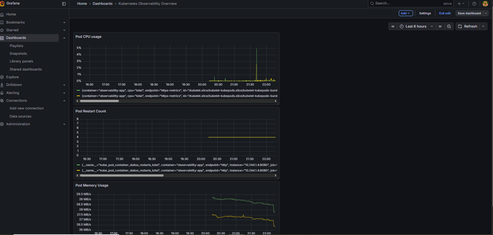
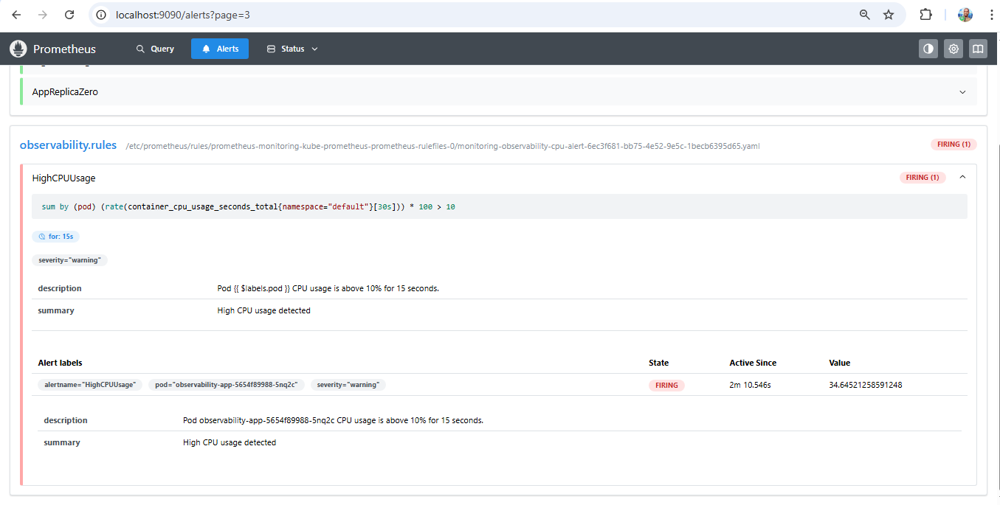
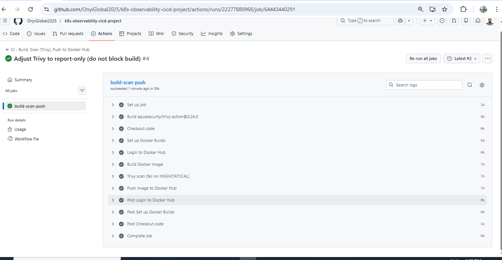
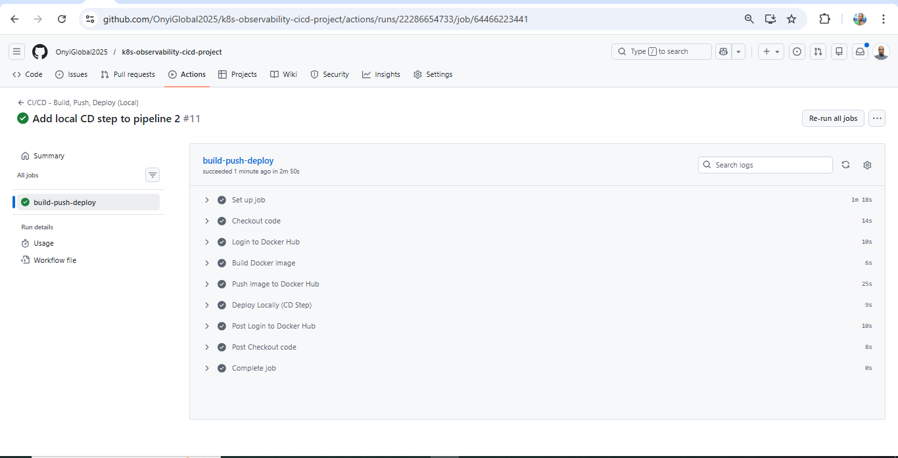

##  Kubernetes Observability + CI/CD Automation Project
##  Overview

This project demonstrates an end-to-end DevOps workflow that starts with Kubernetes observability and monitoring and evolves into a fully automated CI/CD pipeline with Docker and GitHub Actions.

It showcases:

- Kubernetes monitoring using Prometheus & Grafana

- Real-time alerting via Alertmanager + Slack

- CPU, memory, and pod crash detection

- Secure container image build & scan

- Automated Docker image publishing

- Continuous Deployment using a Windows self-hosted runner

This project focuses on visibility, reliability, security, and automation.


##  Phase 1 — Observability & Monitoring (Kubernetes)
## Tools Used

1. Prometheus – Metrics collection

2. Grafana – Visualization dashboards

3. Alertmanager – Alert routing

4. Slack Integration – Real-time alert notifications

- **Grafana dashboard overview**


## Implemented Alerts

- High CPU usage

- High memory usage

- Pod restart detection

- CrashLoopBackOff detection


## What Was Tested

To validate monitoring accuracy, pods were intentionally stressed to trigger:

- CPU alerts

- Memory alerts

- CrashLoopBackOff states


Alerts transitioned correctly from:

```
Pending → Firing → Resolved
```


This validated:

- Metric scraping accuracy

- Alert rule correctness

- Alertmanager routing

- Slack notification delivery

- **CPU alert firing (Prometheus)**


## Key Learning

Monitoring is not about dashboards.
It is about detecting and reacting to failure in real time.


## Phase 2 — Continuous Integration (CI)

- CI was implemented using GitHub Actions.

- CI Workflow Responsibilities

- Build Docker image from application source

- Tag image using:

   - Commit SHA

   - latest

- Scan image using Trivy (vulnerability scanning)

- Push secure image to Docker Hub

- **CI/CD pipeline 1 (Github actions)**


## Image Tagging Strategy

```
onyiglobal/observability-app:<commit_sha>
onyiglobal/observability-app:latest
```

This ensures:

1. Traceability

2. Version control

3. Rollback capability


## Key Learning

CI acts as the integrity gate before deployment.
Security scanning should be integrated into the pipeline — not added later.


## Phase 3 — Continuous Deployment (CD)

- CD was implemented using a Windows self-hosted GitHub Actions runner.

- The runner was configured and executed in interactive mode using:

```
.\run.cmd
```


## Deployment Flow

On every push to main:

- Build Docker image

- Push image to Docker Hub

- Stop running container (if exists)

- Pull latest image

- Redeploy application automatically

- **CI/CD Pipeline 2 (Github actions)**



Deployment command logic:

```
docker stop observability-app
docker rm observability-app
docker pull onyiglobal/observability-app:latest
docker run -d -p 5000:5000 --name observability-app onyiglobal/observability-app:latest
```


## Results

- Every commit now triggers:

```
Build → Scan → Push → Deploy
```

- Application becomes accessible at:

```
http://localhost:5000
```


## Key Learning

Continuous Deployment removes manual deployment friction and ensures consistent release automation.


## Architecture Summary

```
Developer Push → GitHub → GitHub Actions Workflow
                         ↓
              Self-Hosted Runner (Windows)
                         ↓
             Docker Build & Security Scan
                         ↓
                  Push to Docker Hub
                         ↓
              Pull & Redeploy Container
```


## Tech Stack

- Kubernetes

- Prometheus

- Grafana

- Alertmanager

- Slack Webhooks

- Docker

- GitHub Actions

- Trivy

- Windows Self-Hosted Runner


## What This Project Demonstrates

1. Kubernetes observability setup

2. Alert rule creation and validation

3. Real-time Slack alert routing

4. Docker image lifecycle management

5. CI pipeline automation

6. CD automation using self-hosted runner

7. Debugging Windows vs Linux runner differences

8. End-to-end DevOps workflow thinking


## Future Enhancements

- Linux-based self-hosted runner (EC2)

- Production-grade deployment environment

- Infrastructure as Code integration

- Kubernetes-based deployment automation


## Final Reflection

This project reinforced that DevOps is not about writing YAML files.

It is about:

- Detecting failure

- Securing builds

- Automating delivery

- Debugging across environments

- Understanding systems end-to-end

From observability to automated deployment, this project simulates real-world DevOps responsibilities across monitoring, security, CI, and CD.


## Author
Onyedika Okoro

Cloud/DevOps Engineer